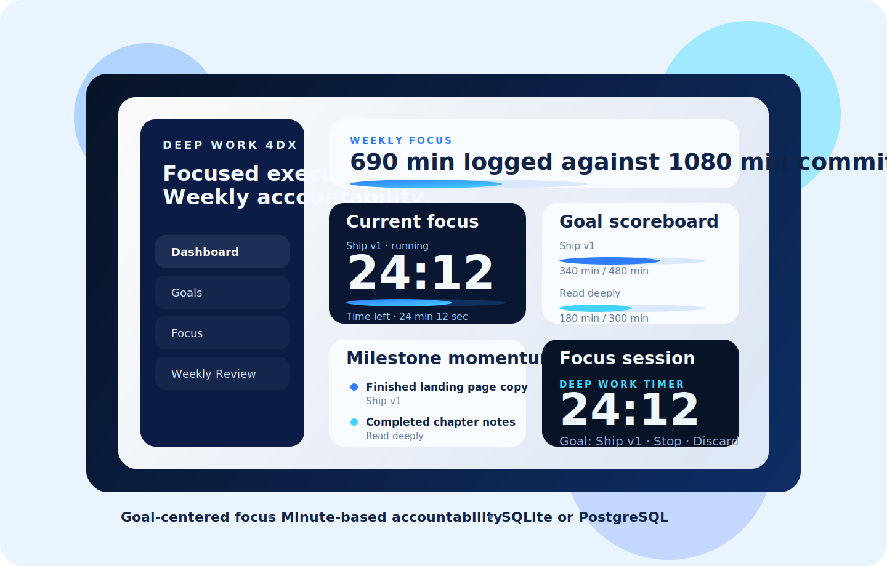
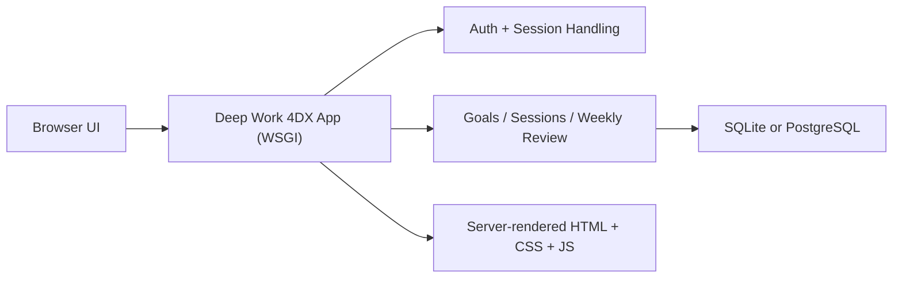

# Deep Work 4DX

> A self-hosted deep-work operating system for private execution, weekly accountability, and goal-centered focus.

<p align="center">
  
</p>

<p align="center">
  <a href="#quick-start">Quick Start</a> ·
  <a href="#database-modes">Database Modes</a> ·
  <a href="#kubernetes">Kubernetes</a> ·
  <a href="#configuration-reference">Configuration</a> ·
  <a href="#development">Development</a>
</p>

Deep Work 4DX is a web app for people who want more than a timer and less than a bloated productivity suite. It gives each user a private workspace where they can define meaningful goals, run focused sessions, capture milestones and notes, and review the week through a 4DX-style scoreboard.

The project is designed for two very different deployment styles:

- `SQLite` for a fast, low-friction personal or small-server setup
- `PostgreSQL` for a more production-oriented deployment with explicit database credentials and server-managed persistence

## Visual Preview

The README artwork is a repo-local SVG composition based on the current product shape: a weekly scoreboard dashboard, an in-app focus timer, and a structured weekly review flow. It is meant to give the project a stronger landing page while staying aligned with the real UI model in the codebase.

## Why This Exists

Most tools are good at storing tasks and bad at shaping attention.

Deep Work 4DX is built around a tighter loop:

1. choose a few goals that matter this week
2. commit target hours
3. run focused sessions against those goals
4. record milestones and notes as progress happens
5. review target versus actual performance at week end

That means the app is intentionally opinionated:

- goals are first-class
- weekly commitments are measured in hours
- focus sessions belong to a goal
- milestones stay append-only
- user data is private by default even on a shared installation

## What It Does

| Area | Current capability |
| --- | --- |
| Authentication | Local email/password accounts with bootstrap admin creation |
| Multi-user | Multiple users on one installation, isolated private data |
| Goals | Create goals, track status, attach milestones and notes |
| Focus | Run in-app focus sessions with timer-driven logging |
| Weekly review | Set target hours, review actual progress, carry forward notes |
| History | View weekly totals and milestone activity |
| Deployment | Local Python run, Docker Compose, Kubernetes manifest |
| Persistence | SQLite quick-start or PostgreSQL-backed startup |

## Product Shape

This is not a generic task manager.

It is a focused system built around:

- `Dashboard` for current-week scoreboard and recent progress
- `Goals` for the long-lived work that matters
- `Focus` for starting and completing deep-work sessions
- `Weekly Review` for commitment, review, and planning
- `History` for lightweight trend visibility

## Focus Session Lifecycle

Focus sessions are goal-bound and use explicit controls:

- `Start` begins a goal session
- `Pause` freezes the timer
- `Resume` continues a paused session
- `Stop` ends the active session and records it in goal history
- `Discard` removes the active session without recording it

Session reliability is server-backed rather than page-local:

- the focus screen polls `/api/session-status` so the UI can recover accurate state
- sessions auto-complete when their timer expires, even if the user leaves the focus page before returning
- logged-in pages now surface live session state outside `/focus`, so running or paused work stays visible until the user jumps back into focus mode

## Architecture



### Runtime characteristics

- server-rendered web app with lightweight JavaScript for the focus timer
- one application process
- one persistence backend selected by configuration
- idempotent startup initialization
- no destructive schema reset on boot

## Quick Start

### Local Python

```bash
export DEEPWORK_SECRET_KEY="$(python3 - <<'PY'
import secrets
print(secrets.token_urlsafe(48))
PY
)"
python3 run.py
```

Then open [http://127.0.0.1:8000](http://127.0.0.1:8000).

### Docker Compose

```bash
docker compose up --build
```

The default Compose setup uses:

- `SQLite`
- port `8000`
- a named volume for `/data`

Before starting Compose, provide `DEEPWORK_SECRET_KEY` from your shell or env file.

## First Admin And User Management

On a fresh installation, the app redirects to `/bootstrap` and requires creation of the first admin account.

Recommended first-run flow:

1. open the app
2. create the first admin account on the bootstrap screen
3. sign in with that admin account
4. open the `Users` page from the sidebar
5. create additional member or admin accounts from the user-management form

Admin workflow notes:

- only admins can access the `Users` page
- the `Make admin` checkbox creates another admin account
- duplicate email addresses are rejected with an inline error
- blank email or password submissions are rejected with inline validation errors
- non-admin users do not get access to user management

## Database Modes

### SQLite mode

SQLite is the default path and is intended for quick setup.

Use:

- `DEEPWORK_DB_BACKEND=sqlite`
- `DEEPWORK_DB_PATH=/data/deepwork.db`

Startup behavior:

- creates the database file if it does not exist
- creates the schema if it is missing
- reuses existing data if the file is already initialized

### PostgreSQL mode

PostgreSQL is the production-grade option.

Use:

- `DEEPWORK_DB_BACKEND=postgres`
- `DEEPWORK_POSTGRES_HOST`
- `DEEPWORK_POSTGRES_PORT`
- `DEEPWORK_POSTGRES_DATABASE`
- `DEEPWORK_POSTGRES_USER`
- `DEEPWORK_POSTGRES_PASSWORD`
- `DEEPWORK_POSTGRES_MAINTENANCE_DATABASE`
- `DEEPWORK_POSTGRES_SSLMODE`

Startup behavior:

- connects to PostgreSQL using the configured credentials
- checks whether the target application database exists
- creates that database if it does not exist yet
- applies the schema idempotently
- never drops existing application data automatically

This assumes the configured credentials are allowed to create the target database on first startup, or that the database is pre-created by the operator.

## Kubernetes

A personal-use Kubernetes manifest is included at:

```bash
deploy/kubernetes-personal.yaml
```

Apply it with:

```bash
kubectl apply -f deploy/kubernetes-personal.yaml
```

The personal manifest is intended to be the easy mode:

- uses `SQLite`
- mounts `/data` on a persistent volume claim
- enables `DEEPWORK_PERSONAL_MODE=1`
- pulls the public image `yavarkhodadadi/deep-work-4dx:latest`

Session-secret behavior in personal mode:

- if `DEEPWORK_SECRET_KEY` is provided, the app uses it
- otherwise the app generates and persists a signing secret at `/data/deepwork-secret.key`
- if the PVC is replaced or cloned, existing sessions are invalidated and users must log in again

The older general-purpose manifest remains at `deploy/kubernetes.yaml` for manual/operator-managed setups.

Before using the personal manifest in a real cluster:

1. ensure your cluster has a default storage class for the PVC
2. confirm the published image `yavarkhodadadi/deep-work-4dx:latest` is reachable
3. bootstrap the first admin user after the pod becomes ready
4. verify persistence by restarting the pod after creating sample data

## Configuration Reference

| Variable | Purpose |
| --- | --- |
| `HOST` | Bind host for the app server |
| `PORT` | Bind port for the app server |
| `DEEPWORK_SECRET_KEY` | Cookie/session signing secret |
| `DEEPWORK_PERSONAL_MODE` | Enables persisted secret bootstrap for personal SQLite deployments |
| `DEEPWORK_WEEK_START` | Week boundary used for reviews and scoreboards |
| `DEEPWORK_FOCUS_MINUTES` | Default focus session duration |
| `DEEPWORK_SHORT_BREAK_MINUTES` | Default short break duration |
| `DEEPWORK_LONG_BREAK_MINUTES` | Default long break duration |
| `DEEPWORK_LONG_BREAK_INTERVAL` | Cycles before long break suggestion |
| `DEEPWORK_DB_BACKEND` | `sqlite` or `postgres` |
| `DEEPWORK_DB_PATH` | SQLite database path |
| `DEEPWORK_POSTGRES_HOST` | PostgreSQL host |
| `DEEPWORK_POSTGRES_PORT` | PostgreSQL port |
| `DEEPWORK_POSTGRES_DATABASE` | Target application database |
| `DEEPWORK_POSTGRES_USER` | PostgreSQL user |
| `DEEPWORK_POSTGRES_PASSWORD` | PostgreSQL password |
| `DEEPWORK_POSTGRES_MAINTENANCE_DATABASE` | Database used for first-run existence checks and bootstrap |
| `DEEPWORK_POSTGRES_SSLMODE` | PostgreSQL SSL mode |

## Development

### Install dependencies

```bash
pip install -r requirements.txt
```

### Run tests

```bash
python3 -m unittest discover -s tests
```

### Current stack

- Python application runtime
- WSGI server via the standard library runner
- SQLite or PostgreSQL persistence
- server-rendered HTML
- custom CSS and small client-side JavaScript for timer behavior

## Project Status

The project already includes:

- local auth and admin bootstrap
- private multi-user isolation
- goal tracking with milestones and notes
- focus session lifecycle handling
- weekly review and scoreboard flows
- SQLite and PostgreSQL startup paths
- Docker and Kubernetes packaging

The project does not yet include:

- external identity providers
- background job workers
- collaborative/team visibility
- a mobile app
- full production hardening around migrations, observability, and CI
